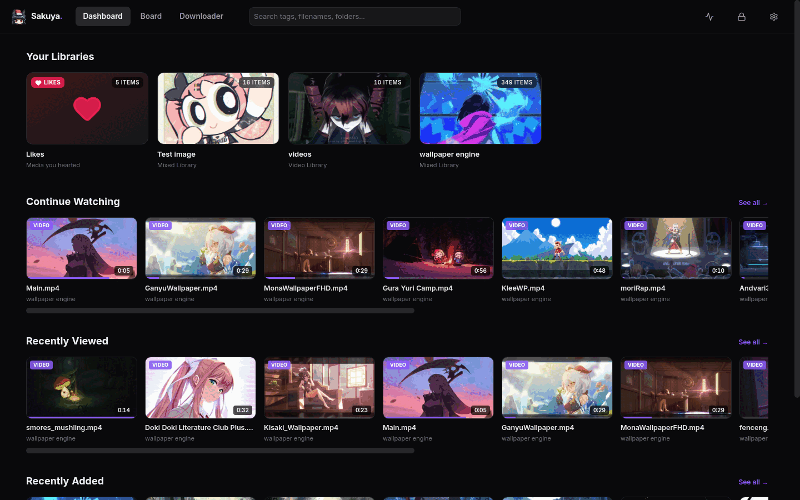
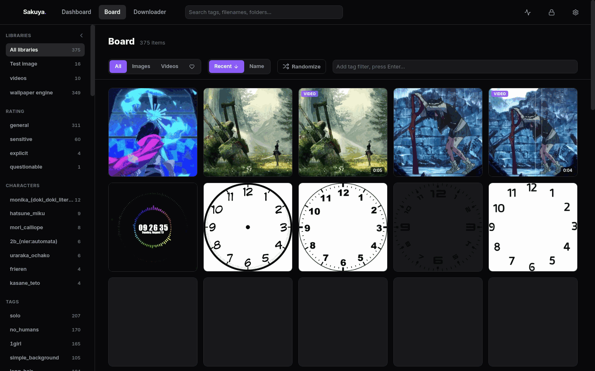
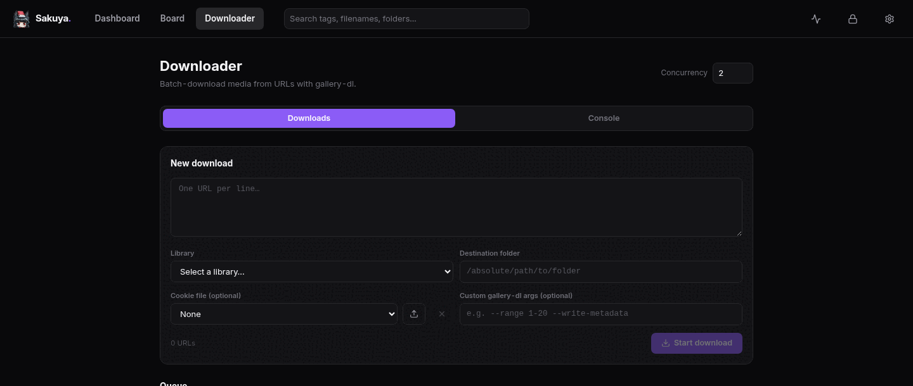

<div align="center">


# Sakuya

**A self-hosted media library that tags itself.**

Point it at folders of images and videos — it scans, thumbnails, and auto-tags your
collection with an AI booru-style tagger, then gets out of your way.

[](https://bun.sh)
[](https://www.typescriptlang.org/)
[](https://react.dev)
[](https://www.sqlite.org/)
[](#license)

</div>

---

## Screenshots

<table>
<tr>
<td width="50%">

**Dashboard** — libraries, continue watching, recently viewed/added


</td>
<td width="50%">

**Board** — tag sidebar, filters, search-as-you-type


</td>
</tr>
<tr>
<td colspan="2">

**Downloader** — batch downloads via gallery-dl, with a live console


</td>
</tr>
</table>

## Features

- 🗂 **Libraries** — organize media into libraries backed by watched folders, with auto-scan that cleans up missing files and thumbnails
- 🤖 **AI Tagging** — auto-tags images with a booru-style ONNX model (WD SwinV2), sorted into rating / character / general tag groups; swap in a different tagger model from Settings
- ✍️ **Manual Tags** — add, edit, or promote your own tags alongside the AI-generated ones
- ❤️ **Likes** — heart anything from its thumbnail or detail view; liked media collects into its own library and filters the board
- ▶️ **Continue Watching** — resumes videos where you left off, updates live, and won't re-add a video that just autolooped
- 🔍 **Duplicate & Similar Detection** — scan a library and review duplicates/near-duplicates side by side, batch-delete what you don't need
- 🖼 **Thumbnails** — automatic thumbnails for images and video (Sharp + FFmpeg), with an opt-out if you'd rather serve originals
- ⬇️ **Downloader** — batch-download from URLs with gallery-dl (auto-installed), cookie file support, an interactive console, and live progress over SSE
- 🎬 **Transcoding** — browser-incompatible video formats get transcoded on the fly
- 📊 **Job Tracking** — every scan/tag/thumbnail/download/model-download runs as a trackable background job
- 🔒 **Optional Auth Gate** — lock the whole UI behind a single shared password for exposing it beyond localhost

## Tech Stack

| Layer | Choice |
|---|---|
| Runtime & package manager | [Bun](https://bun.sh) |
| Backend | Express + TypeScript, SQLite via Drizzle ORM |
| Frontend | React 18 + Vite, React Router, Tailwind CSS |
| ML | ONNX Runtime (`onnxruntime-node`), WD SwinV2 tagger |
| Media processing | Sharp (images), FFmpeg/FFprobe (video/transcoding) |
| Downloads | gallery-dl |

## Quick Start

```bash
bun install   # install deps for all workspaces
bun dev       # server on :3777, web on :5173 (Vite proxies /api)
```

Open `http://localhost:5173`. No configuration required to start — everything lives under
`apps/server/data/` by default.

Prefer scripts? `./setup.sh` installs Bun for you if it's missing, `./run.sh` starts dev, and
`./update.sh` pulls + reinstalls. `.bat` equivalents exist for Windows.

See **[docs/SETUP.md](docs/SETUP.md)** for the full workspace layout, environment variables,
and which folders you should never touch by hand (looking at you, `apps/server/data/`).

## API

The backend exposes a JSON API under `/api` — libraries, media, tags, jobs, settings, the AI
tagger, the downloader, dashboard stats, uploads, and a health check. Full reference with
request/response shapes: **[docs/API.md](docs/API.md)**.

## Project Structure

```
sakuya/
├── apps/
│   ├── server/          # Bun + Express backend
│   │   └── src/
│   │       ├── routes/    # API endpoints
│   │       ├── services/  # Scanning, thumbnailing, tagging, downloading, job queue
│   │       └── db/        # Drizzle schema + SQLite connection
│   └── web/              # React frontend
│       └── src/
│           ├── routes/     # Pages
│           ├── components/
│           ├── hooks/
│           └── lib/
├── packages/shared/      # Types/utilities shared between server and web
└── docker/                # nginx config for the container build
```

## License

Private project.
